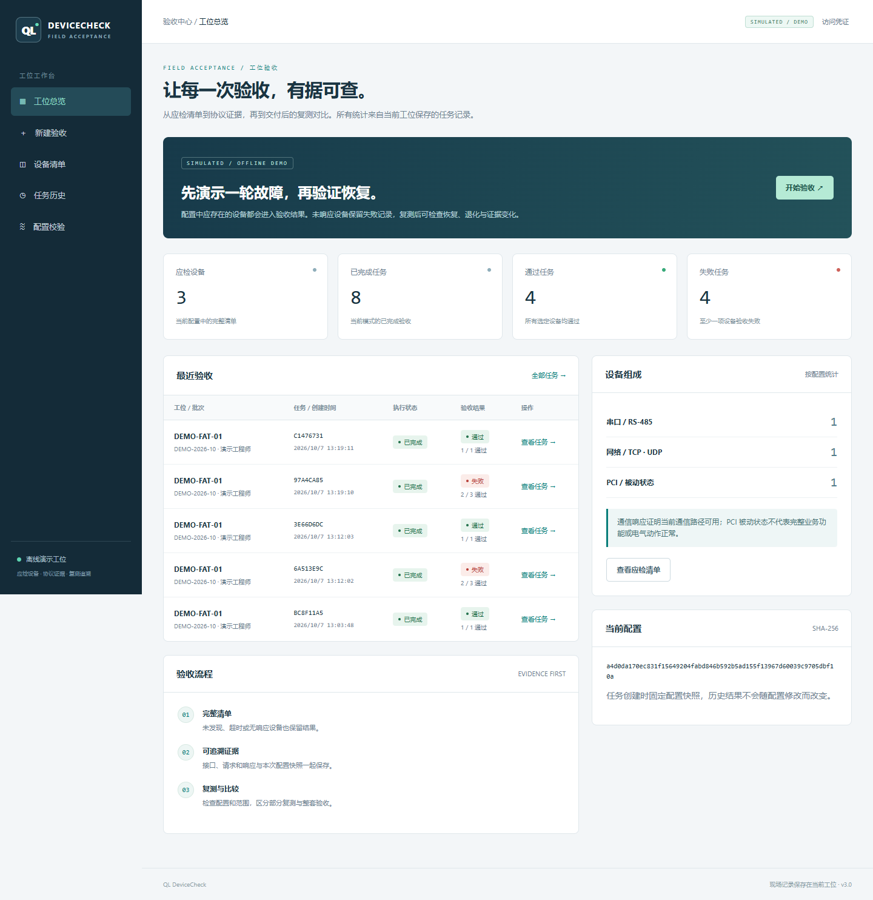

# QLDeviceCheck · Field Acceptance Workbench

[简体中文](README_zh.md) · [Demo](docs/DEMO.md) · [Architecture](docs/ARCHITECTURE.md) · [API](docs/API.md) · [Validation](docs/VALIDATION.md) · [MIT](LICENSE)

A local acceptance station for industrial device vendors and system integrators. Turn an expected equipment list into a traceable inspection: record what was tested, preserve protocol evidence, and compare results after repairs.



## A workflow for delivery and repair

| Field problem | Workbench behavior |
| --- | --- |
| A disconnected device disappears from a discovery list | Every selected configured device gets a result; missing devices remain failures. |
| A report cannot be tied to the configuration used | Each task keeps the full configuration snapshot, SHA-256, station/unit ID, batch, operator and timestamps. |
| Rechecking a repair loses the original evidence | Failed-only retests retain their parent task and original snapshot. Comparison shows recovery, regression and scope limits. |
| A demonstration needs field hardware | `--demo` uses an independent synthetic catalog, visibly stamps reports `SIMULATED`, and separates demo/live statistics. |

The intended position is a lightweight Linux field acceptance workflow with local evidence ownership. The project owner has confirmed the project was tested and is usable. See the [design and positioning rationale](docs/superpowers/specs/2026-10-07-field-acceptance-design.md) and [verification records](docs/VALIDATION.md).

## Try the demo

For a ready-to-install bundle, download the Windows x64 or Linux x86_64 package from [Releases](https://github.com/KaiserIIII/QLDeviceCheck_Generic_WebUI_Linux/releases). Bundles include offline runtime dependencies. Install CPython 3.10+ first; then double-click `Start-Demo.cmd` on Windows or run `bash run_demo.sh` on Linux. [Release guide](docs/RELEASE.md).

Python **3.10+**. The demo and offline checks also run on Windows.

```bash
python -m venv .venv
source .venv/bin/activate
python -m pip install --require-hashes -r requirements-runtime.lock
python web_app.py --demo --data-dir data/demo
```

On PowerShell, activate with `.\.venv\Scripts\Activate.ps1`. Open [localhost:8080](http://127.0.0.1:8080), create a **mixed faults** task, inspect its evidence, then retest with **healthy**. [Demo walkthrough](docs/DEMO.md).

## Field mode

```bash
bash setup_linux.sh
bash run_web.sh --config config/device_list.json --data-dir data/live
```

Review the target equipment and custom request bytes before executing a live task. Built-in acceptance rejects write-labelled operations and Modbus functions outside 01–04. PCI checks are passive. Communication checks do not establish electrical performance or complete business functionality.

| Interface | Existing inspection capabilities |
| --- | --- |
| Serial | Modbus RTU reads 01–04; configured custom request/response matching |
| Network | Modbus TCP, TCP connectivity, custom TCP/UDP checks |
| PCI | Link/driver/interface inspection, including configured child devices |

The original scan UI remains at `/legacy` in live mode, sharing the station execution lock. Its reports remain separate from acceptance history. See [configuration](config/CONFIG_GUIDE.md) and [deployment](docs/DEPLOYMENT.md) for operational boundaries.

## Engineering

The new `inspection/` domain, service, store, adapters, HTTP and report modules isolate the browser workflow from the existing protocol core. SQLite persists task state and evidence; restart marks unfinished work interrupted without replaying hardware operations. A single process owns each station database.

The browser uses local assets without a CDN or frontend framework. Default binding is `127.0.0.1`; network binding requires `QLDC_ACCESS_TOKEN`. The service includes bounded inputs, Host/Origin checks and escaped exports. It does not include multi-user roles or a TLS terminator.

```bash
python -m pip install --require-hashes -r requirements.lock
python validate_config.py
python self_test.py
python -m pytest -q
```

[Validation](docs/VALIDATION.md) records tested paths and remaining hardware risks. [Dependencies](docs/DEPENDENCIES.md) records pinned releases, source commits, licenses and artifact hashes. CI covers offline checks on Windows/Linux with Python 3.10/3.13.
