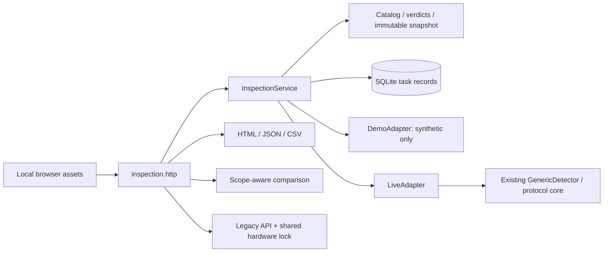
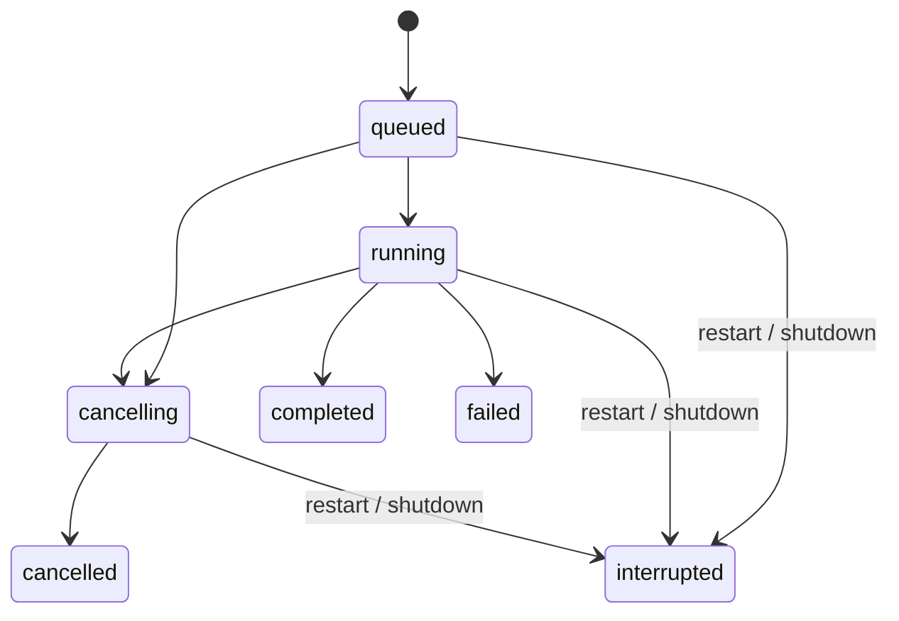

# Architecture / 架构

## Data and execution flow

`web_app.py` parses station options and owns service shutdown. `inspection/http.py` serves an allowlisted set of assets and handles API access checks. `domain.py` defines validation and verdict aggregation. `service.py` owns the worker, state transitions and snapshot-based retests. `store.py` commits whole job records atomically in SQLite WAL mode. Adapters normalize results from either synthetic devices or the existing detector. Reports and comparisons operate on stored records without accessing hardware.

## State and evidence

Each selected configured device starts `NOT_RUN`. The adapter preserves missing devices as `FAIL`; task summary aggregates `PASS`, `FAIL`, `REVIEW`, `NOT_RUN`. A cancelled, failed or interrupted task cannot be classified as fully passed even when previously emitted results passed. Progress advances after device results; live carrier/child groups execute together. Cancellation waits for a group boundary and does not forcibly interrupt a serial/socket call.

Task creation deep-copies configuration, hashes canonical JSON and commits it with metadata before execution. Results and events persist after each update. Retests use that original full snapshot and allow only original non-passing device IDs. Parent IDs retain the evidence chain. Structured attempts preserve every attributed protocol probe, including earlier failed attempts; child-only results retain parent-carrier supporting checks without adding the carrier to the selected result scope. The SHA-256 identifies configuration content; it is not a digital signature or tamper-proof audit log.

Comparisons check unit/station identity, batch, mode, configuration hash and selected/evidence scope. Related failed-only retests can compare shared devices, while declaring partial coverage. Communication-path and passive PCI checks are separate from electrical or business acceptance.

## Ownership and compatibility

One process owns one database, enforced by an OS-held ownership lease acquired before recovery. A second service cannot recover or execute against an owned database; process exit releases the lease. New tasks and legacy calls also share a station mutex. Do not operate the same physical station through different data directories: database ownership does not provide hardware scheduling across separate databases.

The original `web_app.py` implementation is preserved as `legacy_web.py`; the old UI is served at `/legacy`. Legacy reports under `report/` remain independent of SQLite history. The configured active TCP path now assembles fragmented responses with bounded reads; Modbus validation checks frame length, byte counts, identity and expected quantity.

## Local deployment choices

The design uses Python's standard-library HTTP server, threads and SQLite to keep a single-station deployment small. This is intended for a trusted local workstation, not a multi-tenant Internet service. A network-bound station requires a bearer token; managed TLS, user roles, retention, signed reports, distributed scheduling and production service supervision would be separate work.

Demo mode constructs an independent catalog and never imports the real detector through the normal service/API workflow. Scenarios and exports are explicitly marked synthetic. Hardware operations in tests use Fake adapters or loopback sockets.
