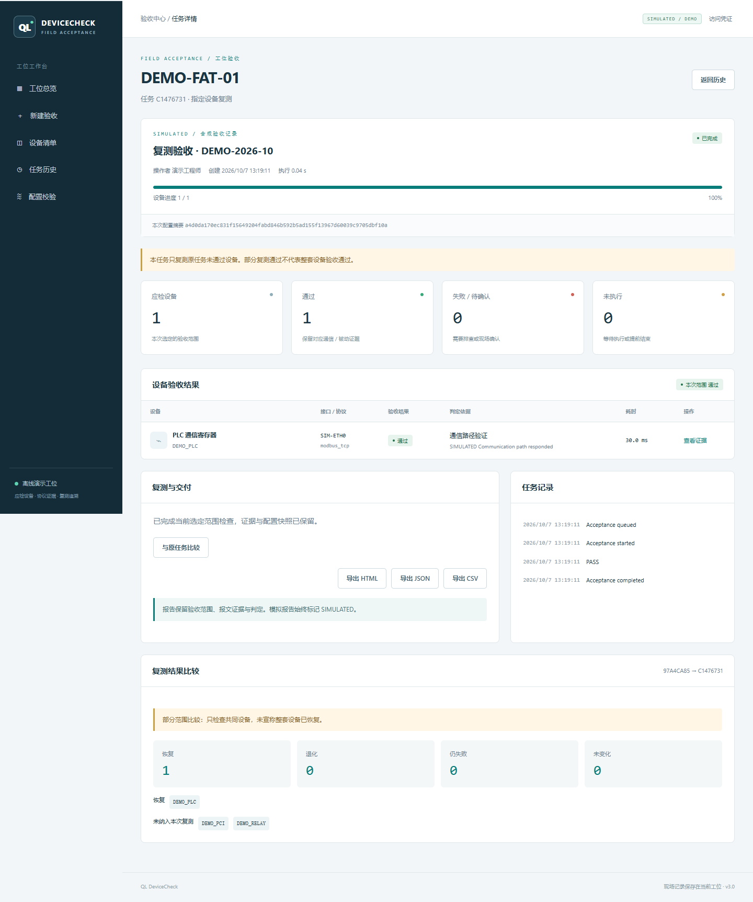

# Demo / 演示验收与修复闭环

No hardware is needed. Start with `python web_app.py --demo --data-dir data/demo`, then open [localhost:8080](http://127.0.0.1:8080). Keep demo/live data directories separate for a clear operating workflow; statistics are also separated by stored mode.

1. Open **新建验收**, enter `DEMO-FAT-01`, batch `DEMO-2026-10`, and an operator. Select **混合故障**.
2. Create the task. Three synthetic devices are expected; one PLC has a synthetic timeout and stays in the result list.
3. Open **查看证据**. Request/response, fault category and a rule-based suggestion remain available. `SIMULATED` means the bytes and verdicts were generated for the demonstration.
4. Export HTML, JSON or CSV. The report includes metadata, the configuration snapshot and coverage. HTML can be opened offline or printed.
5. Select **全部正常**, then **复测未通过设备**. Only the failed device is selected; original successful devices are not silently marked as rechecked.
6. Choose **与原任务比较**. The shared device shows recovery; the page explicitly declares partial scope. This does not establish whole-unit recovery.
7. Refresh the browser and open **任务历史**. Both tasks and their evidence persist. Search by station, batch or operator; select oldest/newest ordering.
8. In **配置校验**, load the current configuration and validate it. This does not change the station configuration or execute device checks.

Additional scenarios: **响应超时**, **CRC 错误**, **设备缺失**, **全部正常**. These are deterministic demonstrations rather than real protocol measurements. Demo mode refuses legacy hardware APIs and does not load the real detector.



## Browser regression script

`tests/browser_workflow.cjs` uses an already available Playwright installation and a disposable running demo server. It creates a fault task, inspects evidence, downloads a report, retests, compares, reloads history, validates configuration and checks the 390 px layout. It fails on page script errors. It is optional and does not install browser binaries or add a production dependency.

```bash
NODE_PATH=/path/to/node_modules PLAYWRIGHT_CHANNEL=chrome node tests/browser_workflow.cjs http://127.0.0.1:18318
```

Screenshots in this repository show synthetic demo data only. They are not records from an industrial customer or device.
